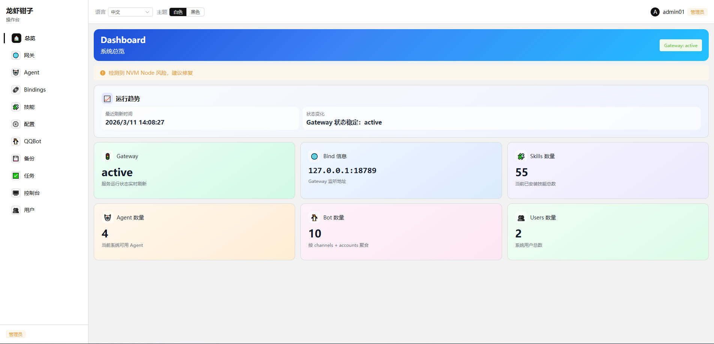
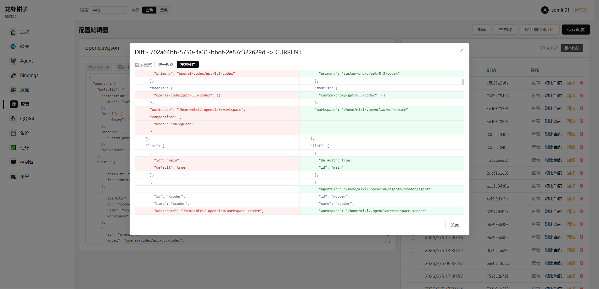
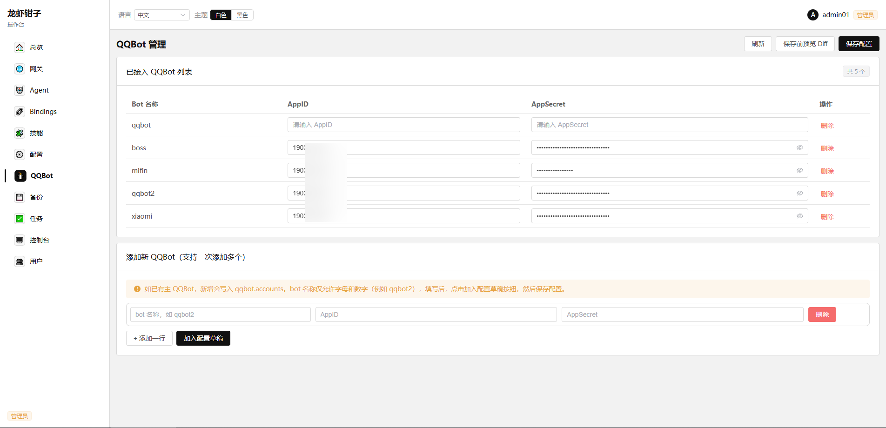
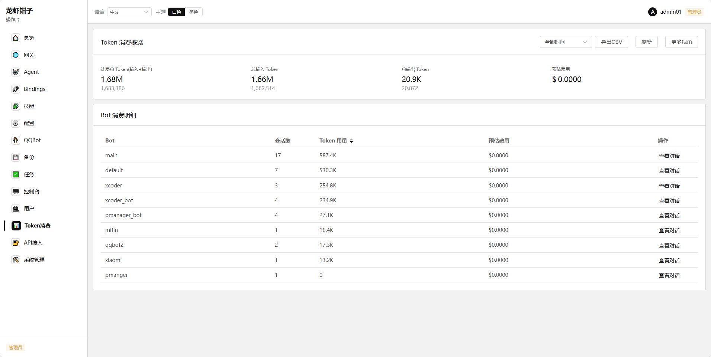
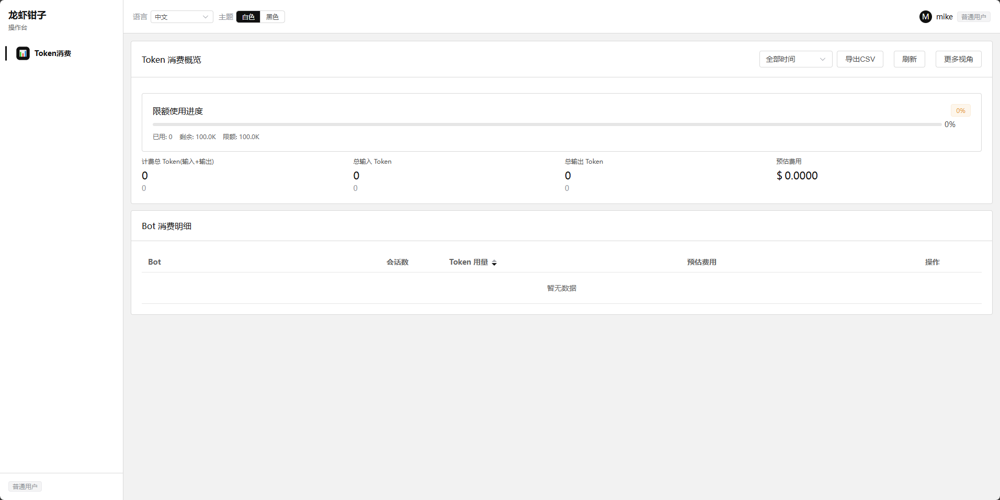
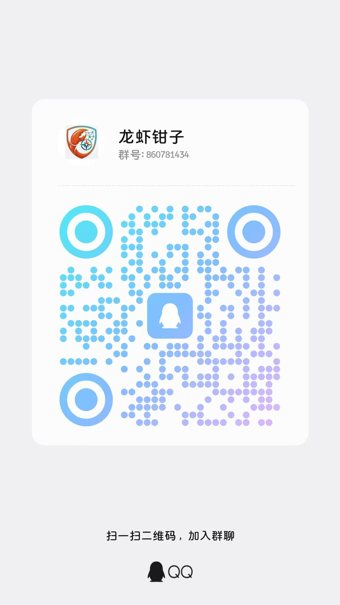

# OpenClaw Manager

轻量OpenClaw Gateway管理平台（Go + Vue + SQLite），用于管理和备份 OpenClaw Gateway 各种配置文件 与 Agent。

## 核心功能及特色

- 安全修改openclaw.json，agent各个配置文件（AGENTS.md/SOUL.md/）
- 支持修改文件历史版本管理、修改对比、安全回滚
- Agent快速创建，bot与agent快捷绑定
- openclaw配置手动与自动备份
- 通过web方式执行openclaw相关命令
- 快速添加多个QQbot
- 简单的多用户体系,支持多个用户使用一个openclaw
- token使用统计，总体费用预估，单用户费用预估
- 自主注册开关，用户与bot关联

## 20260313更新
- 新增多用户支持：支持用户和bot绑定，一只龙虾多人食用
- token使用统计：支持总体token统计，分用户token用量统计
- 支持插件备份
- 管理员重设密码，入口 /resetpwd,使用reset_super_token作为超级

## TODO
- LLM API接入新增与修改
- 更多bot快速接入

可以任意折腾你的小龙虾，主打一个改不死。

## 架构

- 后端：Go 1.22+
- 前端：Vue 3 + Element Plus
- 数据：SQLite
- 认证：JWT + Refresh Token
- 日志：SSE

## 快速部署

1. 下载文件创建目录解压文件：

```bash
mkdir ~/.openclaw-manager
tar -xzf openclaw-manager-xxxx.tar.gz -C ~/.openclaw-manager --strip-components=1
cd ~/.openclaw-manager
```
2. 准备配置：

- `~/.openclaw-manager/config.toml`
- 设置 `jwt_secret`,`reset_super_token`（>=32 字节）
3. 安装 systemd user service：

```bash
./scripts/install.sh
```
4. 查看状态：
```bash
systemctl --user status openclaw-manager.service
```
5. 重启服务
```
systemctl --user restart openclaw-manager.service
```

## config.toml 关键配置

```toml
[server]
listen = "0.0.0.0:18799"

[auth]
jwt_secret = "replace-with-strong-secret-32bytes-min"
reset_super_token = "replace-with-another-strong-secret-32bytes-min"
access_token_ttl = "15m"
refresh_token_ttl = "168h"
public_registration = true
password_min_length = 8

[paths]
openclaw_home = "~/.openclaw"
manager_home = "~/.openclaw-manager"
```

## 注意事项
- reset_super_token是重设管理员密码的重要凭证，请妥善保管。一旦泄露，危害巨大，请定期修改！
- 只在linux环境下测试使用，其他环境不适用
- 用户角色四种 admin/operator/viewer/user,admin全部权限，viewer只有查看权限，无修改权限,user普通使用者，只用户统计token使用情况
- 第一次运行，注册的第一个用户默认为管理员权限。后续注册用户默认为普通使用者

## 截图
### 主页


### 配置页


### QQBot


### 多用户和token 预估



### 沟通群


## License

本项目采用 **非商业许可协议（NCL）**。

允许：
- 个人学习
- 研究用途
- 非商业项目使用
- 修改与二次开发

禁止：
- 商业产品使用
- SaaS 服务
- 企业内部商业系统
- 未授权商业盈利

商业授权请联系作者：<bfilestor@gmail.com>
